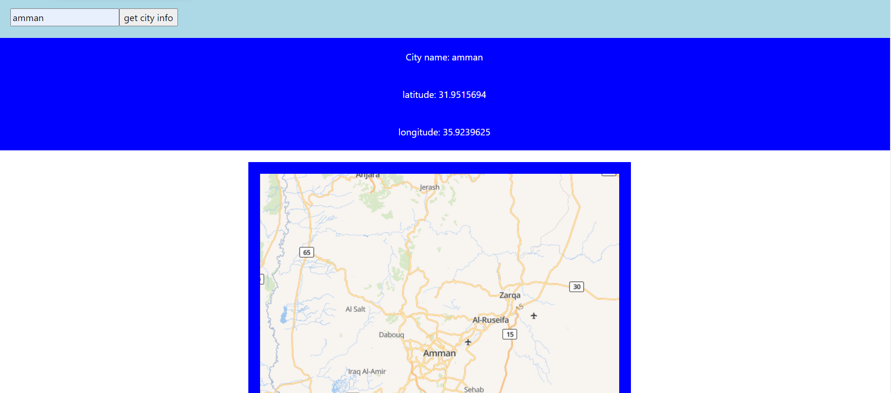

# BTEC

## API Explain

+ API is the acronym for Application Programming Interface, which is a software intermediary that allows two applications to talk to each other.

## API types

+ public PI: Any outside developer or business can utilize a public API because it is open and available. A company that develops and offers a public API will have a business model that includes sharing its applications and data with other companies.

Authentication and authorisation are usually moderate in public APIs. An organization may also try to monetize the API by charging a per-call fee to use the public API.

+ partner API: A partner API is a tool for facilitating business-to-business transactions that is only available to a small group of outside developers or API consumers. For example, if a company wishes to share customer data selectively with outside CRM businesses, it can utilize a partner API to connect the internal customer data system with those external partners — no other API use is allowed.
Access to such APIs is limited to partners with specific permissions and licenses. As a result, partner APIs typically include more robust authentication, authorisation, and security features. In addition, most businesses do not directly monetize APIs; rather, partners are compensated for their services, not for API usage.

+ internal API: An internal (or private) API is designed to connect systems and data within the company. An internal API, for example, might link an organization's payroll and HR systems.

Because internal APIs are meant for internal usage, and such security levels are presumed to be in place through other policies, they typically have minimal security and authentication — or none at all. This is changing, however, as organizations' API strategies are more influenced by increased threat awareness and regulatory compliance requirements.

+ Composite APIs: Composite APIs are made up of two or more APIs that work together to create a series of connected or interdependent activities. Composite APIs can be useful for addressing complex or closely linked API behaviors, and they can occasionally outperform individual APIs in terms of speed and performance.

## benefits of using APIs:

+ Application: Service and information delivery can be more versatile because to APIs' ability to access app components.

+ Efficiency: When you use an API, the content you develop can be instantaneously published and distributed across all channels. It makes sharing and disseminating information more easier.

+ Personalization: APIs empower any user or organization to customize the content and services they use the most.

+ Automation: APIs allow machines to perform things instead of people. APIs can be used by agencies to make workflows more efficient and productive.

+ flexibility: An API can be used to build an application layer that can be adjusted to give unique user experiences and can be used to disseminate information and services to new audiences.

+ Adaptation: APIs can help anticipate changes in demand as they occur over time. When this technology is used, data migration is made easier and information is analyzed more completely.

+ Integration: APIs make it simple to incorporate data from any website or application. This allows for a more fluid delivery of information as well as a more integrated user experience.

## comparing between APIs and SDK:

In software development, API and SDK are two ideas. The term "API" refers to programming instructions and standards for connecting with a website or database. A software company, for example, may make its API available to other software developers on a regular basis, either publicly or privately, so that they can create products that utilise the service. An SDK (Software Development Kit) is a tool that may be used to package an API. An SDK is a collection of software development tools that enable you to build apps for a certain platform. SDKs contain one or more APIs, as well as development tools and documentation.
the SDK is a collection of tools or components for a specific purpose, whereas an API is only an interface to a service.
The SDK provides you with an API to interact with, but if the API is provided without the underlying components, you can use it.
the SDK is a development kit that makes it easier to use an API. An API is a set of libraries that make up the core language and can be used right away. Both are ways for your application to interface with and control resources provided by another piece of software, at least in theory.

## security of API:

APIs are being utilized more than ever to connect services and move data, thanks to the explosive rise of microservices and the push to build more applications faster. APIs (both your own and those provided by third parties) are getting increasingly difficult to secure as a result of the growing number of smaller application "pieces" attempting to connect with one another.

When you add in the pressure on developers to produce a lot, you've got yourself a prescription for a security nightmare.

Broken object level, user and function-level authorization, excessive data exposure, lack of resource, security misconfiguration, and insufficient logging and monitoring are among the most serious API security threats.

These and other dangers have far-reaching consequences. In reality, API flaws have been blamed for some of the most recent security breaches. This includes the infamous Cambridge Analytica data breach, in which a Facebook API flaw exposed over 50 million people's personal information. That's just one of many of cases where poorly built and/or secured APIs have exposed sensitive personal and competitive information.

With the growing number and pace of microservice-based apps, businesses must take API security more seriously than ever before by implementing a development pipeline that evaluates and applies security from beginning to end.

## advice for the securety in apI:

1. Identify vulnerabilities: Knowing which stages of the API lifecycle are unsafe is the only way to adequately safeguard APIs. Of course, this is easier said than done, especially as the company's API usage grows. It's critical to think about the entire API lifecycle, because APIs must be treated as software artifacts in and of themselves, with a complete lifecycle that includes maintenance and retirement.

2. Leverage OAuth: Access control for authentication and authorisation is one of the most critical parts of API security. OAuth, a token-based authorization mechanism that permits information to be accessed by third-party services without exposing user credentials, is a powerful tool for limiting API access.

3. Use tokens: Token use is a good API security best practice in general. Tokens granted to identities are a simple but efficient approach for developers to establish trustworthy identities and control access to services.

## city explorer:

+ API Usage:
we needed for a special API system that will be frindly with the user and used to find the location that the user need by entering the location name and click on the button then a map will be shown to the user 

+ API Description: 
A connection between computers or computer programs is known as an application programming interface (API). It's a form of software interface that provides a service to other programs. An API specification is a document or standard that defines how to create such a connection or interface.

+ API Endpoints/Request URLs:
what is it? A web service endpoint is a web address (URL) through which consumers of a particular service can access it. Customers can access operations provided by that service by mentioning that URL. The endpoint is a point of connection where HTML files or live server pages can be accessed.

Region 2: Europe GET https://eu1.locationiq.com/v1/search.php?key=YOUR_ACCESS_TOKEN&q=SEARCH_STRING&format=json

+ Authentication Key:
pk.8d9e12b2ab541bdaf352287d598c2de6

+ Link for the location iq:

https://stoic-dubinsky-a838f6.netlify.app/

## Testing:

+ Black box: Testing is classified as high-level testing since its primary purpose is to evaluate functionality from a behavioral standpoint.

+  White box: When you have insight into the code and/or general knowledge about the architecture of the software in question, you can perform clear box testing.

+ 

this is a screenshot of the interface for city explorer and as you can see we have the search box and the button where the user should use it to search for the place.

+ 

in this screenshot you can see that after the user search for a city the information about the city will be shown down of the search box in the middle with info about latitude and longitude.

+ 

in this screenshot we see the map of the needed location and its to help the user to find the location that he want on the map.

+ this is the website link:

https://stoic-dubinsky-a838f6.netlify.app/

## Refrence:

1. https://techbeacon.com/security/critical-api-security-risks-10-best-practices#:~:text=The%20most%20critical%20API%20security,and%20other%20risks%20are%20huge.

2. https://www.cmswire.com/information-management/15-api-management-platforms-that-make-the-short-list/

3. https://en.wikipedia.org/wiki/API#:~:text=An%20application%20programming%20interface%20(API,is%20called%20an%20API%20specification.

4. https://www.grandmetric.com/2021/03/11/blackbox-whitebox-testing/