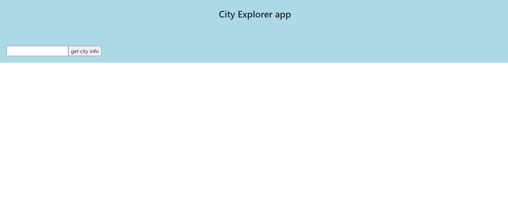
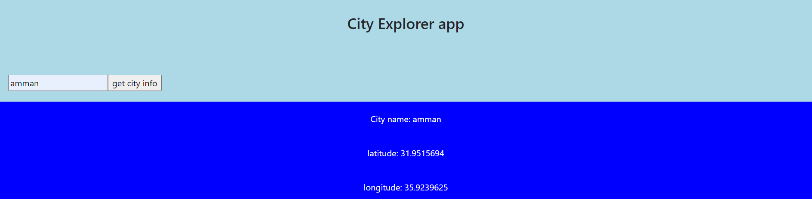
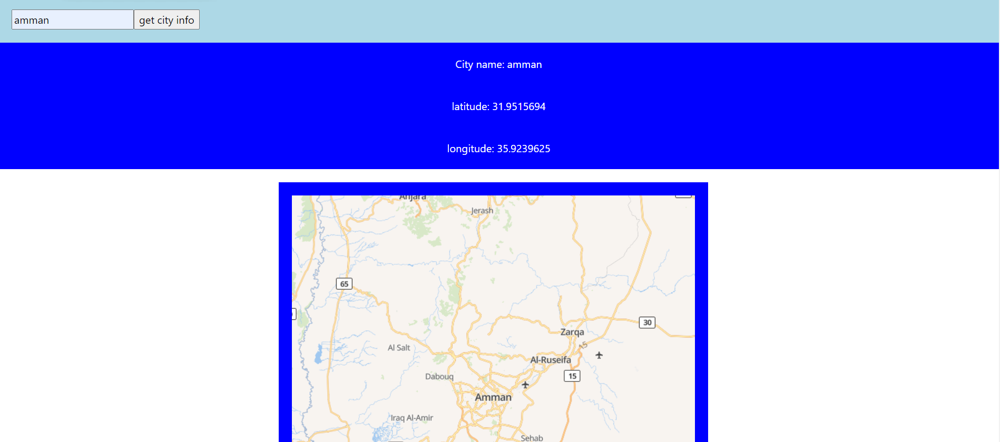

## Testing:

+ Black box: Testing is classified as high-level testing since its primary purpose is to evaluate functionality from a behavioral standpoint.

+  White box: When you have insight into the code and/or general knowledge about the architecture of the software in question, you can perform clear box testing.

+ 

this is a screenshot of the interface for city explorer and as you can see we have the search box and the button where the user should use it to search for the place.

+ 

in this screenshot you can see that after the user search for a city the information about the city will be shown down of the search box in the middle with info about latitude and longitude.

+ 

in this screenshot we see the map of the needed location and its to help the user to find the location that he want on the map.

+ 

this screenshot is for a function that used to get location to show it for the user.

+ 

this screenshot for the location IQ key that used to make the website more secure and each website have a special key.

+ 

this screenshot shows the step that give the user information that he needs and show the map and the other information that we asked for.

+ this is the website link:

https://stoic-dubinsky-a838f6.netlify.app/
